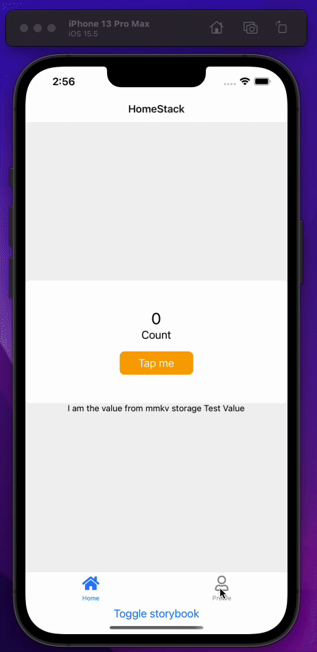
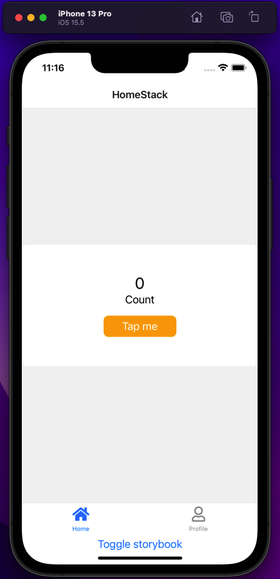
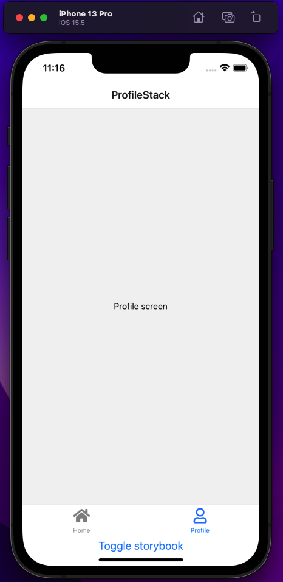
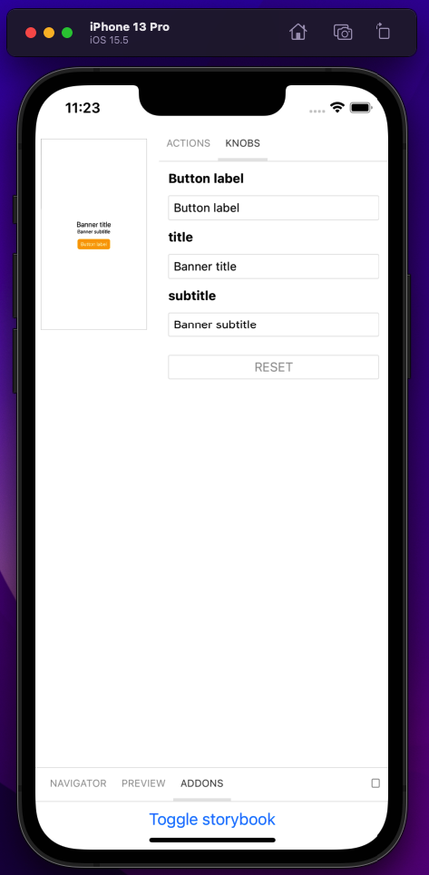
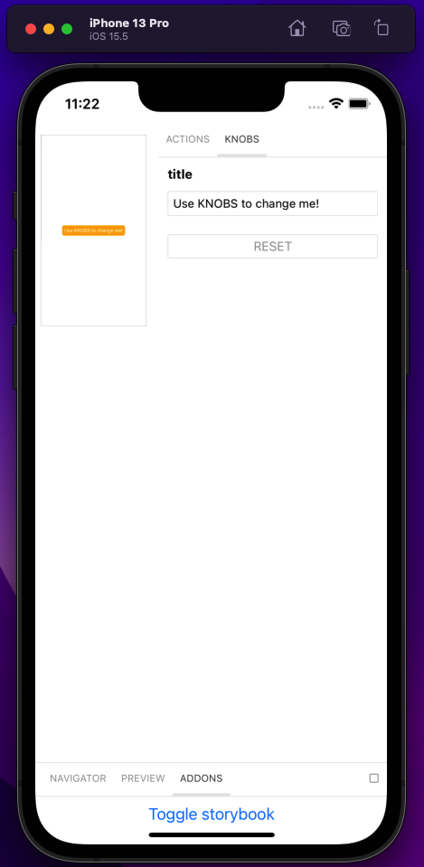
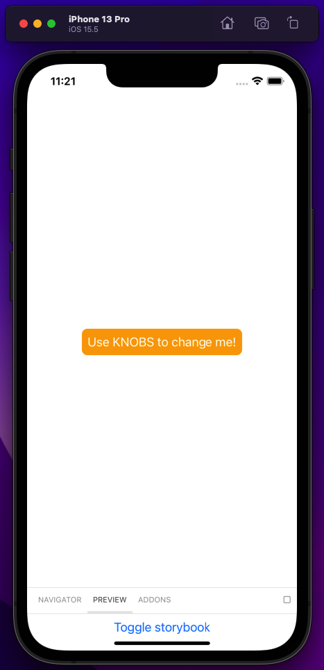
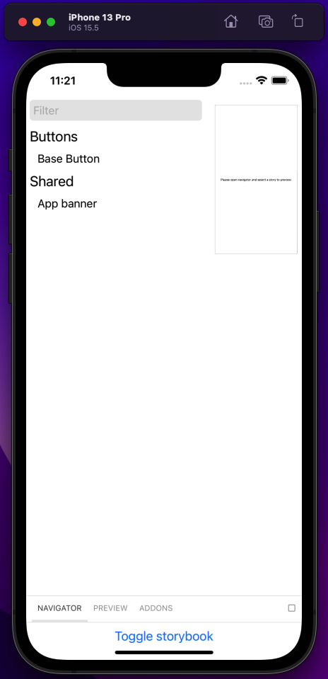
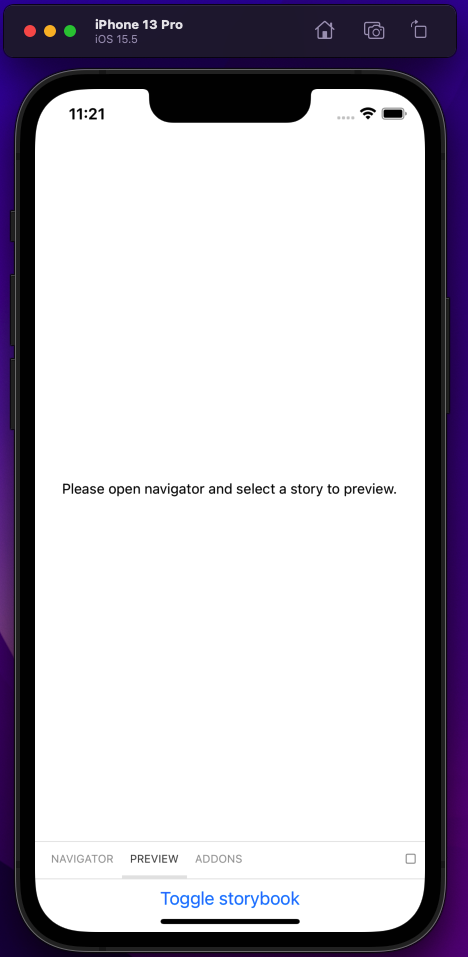

# React Native Typescript Starter

This is a starter project along with boilerplate code which aims to create scalable, robust and enterprise level React Native Typescript applications 🚀

## What is in it?

- Pre configured [react-native-storybook 📙](https://github.com/storybookjs/react-native). Launch the app and toggle the UI between storybook and react native!
    
    Moreover, there will not be any manual effort needed for importing story entries thanks to [react-native-storybook-loader](https://github.com/elderfo/react-native-storybook-loader) library.

  - Storybook scripts in package.json
    ```        
    "storybook": "start-storybook -p 6006",
    "prestorybook": "rnstl" // react-native-storybook-loader
    ```
    
- [Detox 🤖](https://github.com/wix/Detox) for gray box end-to-end testing.

    - Detox scripts in package.json
        ```
        "test:e2e": "detox test -c ios.sim.debug",
        "build:e2e": "detox build -c ios.sim.debug",
        "ci:test:e2e": "detox test -c ios.sim.release -l verbose --cleanup",
        "ci:build:e2e": "detox build -c ios.sim.release",
        ```
- React native, typescript specific robust [eslint](https://eslint.org/) configurations to enhance development experience.
    - Some of eslint configurations are the followings:
        - [Airbnb eslint](https://www.npmjs.com/package/eslint-config-airbnb)
        - [Airbnb typescript eslint](https://www.npmjs.com/package/eslint-config-airbnb-typescript)
        - [React native community eslint](https://www.npmjs.com/package/@react-native-community/eslint-config)
        - [Eslint plugin react hooks](https://www.npmjs.com/package/eslint-plugin-react-hooks)
        - [Eslint plugin react native](https://github.com/intellicode/eslint-plugin-react-native)
        and more... 💫
- Debugging 🛠 is one of the fundamental phase of development. [Reactotron](https://github.com/infinitered/reactoron) is ready for this purpose already!
- Initializing navigation packages in react native applications can be overwhelming and time consuming. [React navigation v6](https://reactnavigation.org/) is already installed and initialized along with required packages such as [react-native-screens](https://github.com/software-mansion/react-native-screens), using strongly typed typescript. 
- It is significant to write a good commit message, especially when you are collaborating with a team or a developer. Here comes [Commitlint](https://github.com/conventional-changelog/commitlint). It is initialized with the base config!
- There might be specific scenarios that some actions might need to be executed before committing or pushing the code. [Husky ⚓️](https://github.com/typicode/husky) will take the responsibility for improving the commits along with commitlint. [Husky](https://github.com/typicode/husky) with [commitlint](https://github.com/conventional-changelog/commitlint) is 💣.

## Packages 🎉

- [React Navigation v6](https://reactnavigation.org/): Start quickly with built-in navigators that deliver a seamless out-of-the-box experience.
- [React Navigation Bottom Tabs v6](https://reactnavigation.org/docs/bottom-tab-navigator/): A simple tab bar on the bottom of the screen that lets you switch between different routes.
- [React Native Vector Icons](https://github.com/oblador/react-native-vector-icons): Customizable Icons for React Native with support for image source and full styling.
- [React Native Date Time Picker](https://github.com/react-native-datetimepicker/datetimepicker): React Native date & time picker component for iOS, Android and Windows.
- [React Native MMKV](https://github.com/mrousavy/react-native-mmkv): The fastest key/value storage for React Native. ~30x faster than AsyncStorage!
- [React Native Net Info](https://github.com/react-native-netinfo/react-native-netinfo): React Native Network Info API for Android & iOS.
- [React Native Keychain](https://github.com/oblador/react-native-keychain): Keychain/Keystore Access for React Native
- [React Native Dotenv](https://github.com/goatandsheep/react-native-dotenv): Load react native environment variables using import statements for multiple env files.
- [React Native Modal](https://github.com/react-native-modal/react-native-modal): An enhanced, animated, customizable Modal for React Native.
- [Detox](https://github.com/wix/Detox): Gray box end-to-end testing and automation framework for mobile apps.
- [React Native Clean Project](https://github.com/pmadruga/react-native-clean-project): Automating the clean up of a React Native project.
- [React Native Storybook](https://github.com/storybookjs/react-native): With Storybook for React Native you can design and develop individual React Native components without running your app.
- [React Native Utils](https://github.com/tarikpnr/react-native-utils): Utility functions for react native projects.


## Running e2e test 🤖

There is an already initial setup for e2e test in the project. Make sure you run the build script for detox beforehand, then simply executing `detox test` will have the following result.


### Code
```
const { reloadApp } = require("./reload");

describe("Example", () => {
  beforeEach(async () => {
    await reloadApp();
  });

  it("should have welcome screen", async () => {
    await expect(element(by.id("WelcomeScreen"))).toBeVisible();
  });

  it("should tap the button and counter should be increased by one", async () => {
    await element(by.id("tap-me")).tap();
    await expect(element(by.id("counter"))).toHaveText("1");
  });
});
```

## Storybook usage 📙

Toggle between storybook and app seamlessly!




## Path resolver
Nested folders can be seen more frequently if the project gets larger by the time goes on.

And the path for importing any module from deeper component could be the following: 
```
import AppButton from "../../../../../components/button/app-button"
```
Fortunately, [Babel plugin module resolver](https://github.com/tleunen/babel-plugin-module-resolver) with typescript resolves this issue with some quick configurations which is already covered in this project. 
```
import AppButton "~components/button/app-button"
```


## Folder structure

The project folder structure is the following. 


```
src
   |-- api
   |   |-- axios.instance.ts
   |-- app.tsx
   |-- assets
   |   |-- data-uris.ts
   |   |-- fonts
   |   |-- images
   |   |-- index.ts
   |-- components
   |   |-- button
   |   |   |-- button.stories.tsx
   |   |   |-- button.test.tsx
   |   |   |-- button.tsx
   |   |   |-- index.ts
   |   |-- safe-area
   |   |   |-- index.ts
   |   |   |-- safe-area-provider.tsx
   |   |   |-- safe-area-view.tsx
   |   |-- shared
   |   |   |-- banner
   |   |   |   |-- banner.stories.tsx
   |   |   |   |-- banner.test.tsx
   |   |   |   |-- banner.tsx
   |   |   |   |-- index.ts
   |-- config
   |   |-- reactotron.ts
   |-- index.ts
   |-- lib
   |   |-- async-storage
   |   |   |-- index.ts
   |   |-- constants
   |   |   |-- index.ts
   |   |   |-- regex.ts
   |   |   |-- validation.ts
   |   |-- user
   |   |   |-- index.ts
   |   |   |-- user.interface.ts
   |-- localization
   |   |-- constants
   |   |   |-- langauge.ts
   |   |-- helpers
   |   |   |-- language-resources.ts
   |   |   |-- language.ts
   |   |-- i18n.ts
   |   |-- locales
   |   |   |-- de_DE.json
   |   |   |-- en_US.json
   |-- navigation
   |   |-- helpers
   |   |   |-- tabbar-options.tsx
   |   |   |-- tabbar-routes.ts
   |   |-- root-navigator.tsx
   |   |-- route-names.ts
   |   |-- stacks
   |   |   |-- auth.tsx
   |   |   |-- home.tsx
   |   |   |-- profile.tsx
   |   |-- tabbar.tsx
   |   |-- types
   |   |   |-- auth.ts
   |   |   |-- home.ts
   |   |   |-- index.ts
   |   |   |-- profile.ts
   |   |   |-- tabbar.ts
   |-- screens
   |   |-- error
   |   |   |-- fallback-screen.tsx
   |   |   |-- index.ts
   |   |   |-- main-error-boundary.tsx
   |   |-- home
   |   |   |-- helpers
   |   |   |   |-- index.ts
   |   |   |-- home-screen.tsx
   |   |   |-- hooks
   |   |   |   |-- index.ts
   |   |   |-- index.ts
   |   |-- launch
   |   |   |-- index.ts
   |   |   |-- launch-screen.tsx
   |   |-- login
   |   |   |-- index.ts
   |   |   |-- login-screen.tsx
   |   |-- profile
   |   |   |-- index.ts
   |   |   |-- profile-screen.tsx
   |   |-- sign-up
   |   |   |-- index.ts
   |   |   |-- sign-up-screen.tsx
   |-- scripts
   |   |-- setup-debug.ts
   |-- theme
   |   |-- common-styles.ts
   |-- types
   |   |-- env.d.ts
   |-- utils
   |   |-- ignore-logs.ts
   |   |-- index.ts
   |   |-- list.ts
   |   |-- network-activity.ts
   |   |-- storybook
   |   |   |-- index.ts
   |   |   |-- withStorybook.tsx
```


At first glance, some may think; ["Hey, React suggests PascalCase for React components! Why you did not use PascalCase here ?"](https://reactjs.org/docs/faq-structure.html) 

First thing can be noticed easily is that all of the file names are named in [kebab-case](https://en.wiktionary.org/wiki/kebab_case) convention. There are several reasons behing this decision. [One of them is related to CI system](https://twitter.com/kentcdodds/status/1249870276688371713?lang=en). This might not look reasonable for everyone though. 
### Personal thoughts regarding the naming convention
Having solely one naming convention throughout the project looks more solid and professional. Rather than using PascalCase (AppHeader.tsx) or kebap-case (header-utils.ts) depending on the situtation, having all file names with single naming convention is a way to go. 

There is no *BETTER naming convention* or *you MUST use this naming convention* rule.

Therefore, feel free not to stick with kebap-case naming convention.


## Usage

- Clone the project

```
git clone https://github.com/tarikpnr/react-native-typescript-starter.git
```

- [react-native-rename](https://github.com/junedomingo/react-native-rename) for renaming project to the desired one.


## Screenshots

<table>
  <tr>
 
  </tr>
  <tr>
    <td></td>
    <td></td>
    <td></td>
  </tr>
    <tr>
    <td></td>
    <td></td>
    <td></td>
  </tr>
    <tr>
    <td></td>
    <td></td>
  </tr>
 </table>

## License

MIT
